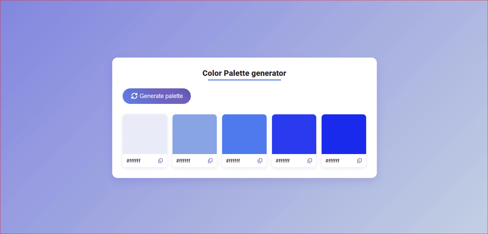

# 🎨 Color Palette Generator

A smart color palette generator built with **HTML, CSS, and JavaScript**.

## ✨ Features
- Generate random color palettes
- Copy color codes to clipboard
- Multiple color harmony modes (planned)
- Lock colors (planned)
- Export palettes (planned)

## 🚀 Live Demo
https://tonepalette.netlify.app/

## 🛠️ Built With
- HTML5
- CSS3
- Vanilla JavaScript

## 📌 Future Improvements
- Color harmony rules (Analogous, Monochrome, etc.)
- Save palettes to favorites
- Export palette as image or CSS variables
- Generate palette from image
- Share palette via URL

## 📄 License
MIT
